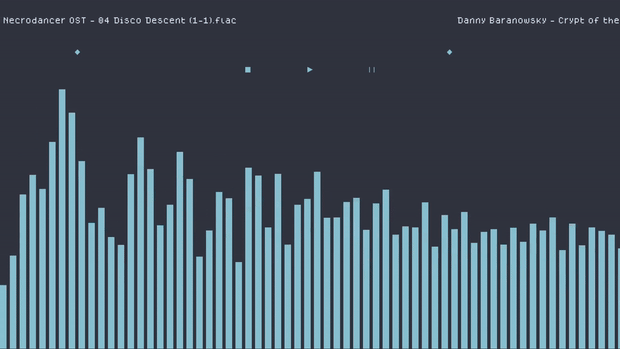

# USAGE RESTRICTIONS
 
**By using this music player, you agree to only use music that you have legally obtained the rights to. This includes, but is not limited to, music that you have purchased, obtained through legitimate streaming services, or that is freely available for use under open licenses. Any unauthorized use of copyrighted music is strictly prohibited and may result in legal action.**

## Music Visualizer


**A music visualizer for Linux systems written in C. This is unfinished software, and the program is mostly written with only my personal use in mind. So please be considerate of this.**

I'm still thinking of a name for this program, haven't really thought of anything yet so I'm just going with Music Visualizer for now. 

## Todo
> - Setting up a settings menu for manipulation of the internal variables of the program.

## Releases
I have builds for Windows on x86 architecture at the releases page.

For Linux, go to the build section. I will be whipping up a release for Linux soon as well.


**For more details on how the program works, go below.**

## Usage Manual
**For understanding on how to properly use the program please read the following**.

---
> When the program looks for directories and files, it will replace spaces and comas from folders and files with underscores using rename().
 
The program relies on directories located in the **~/Music dir located in the home path**.

> Foundational directories will be **created on the initial program launch if they do not already exist:**
- ```fftmlogs``` which contains ```errlog.txt``` and ```log.txt```
- ```fftmplayer``` which is where your music will be located. **The program expects folders inside this directory**, of which contain the audio files.
---

**Your music and folders will be listed when there is no music playing ; you can scroll through with the mouse wheel**. 

## Controls
- Space : Play or Stop
- p : Pause or Resume
- Left and right arrow keys : Cycle through songs
- r : random song
- q : Quit

## BUILDING

My program depends on these libs:

1. libsndfile
2. SDL2-devel
3. SDL2_ttf-devel
4. SDL2_image-devel


For my windows binary, I use MingGW to compile.
For linux I am mainly using clang, but there are options for GCC.

> You have a few options when it comes to building.

If you have the dependencies installed via your package manager you can simply run the build script. Note that this uses clang.

```./build_linux.sh```

I also have a build script to statically compile into a binary. This uses GCC. Due to the nature of SDL2 and sndfile there may be issues, however, you can use it with ```linux_build_static.sh```

If you want to build for a windows target - there are a few steps.

1. run ```fetch_win_resources.sh```
> This fetches the libs and everything you will need to build. It sets everything up automatically.
2. run ```make``` and then ```make install```
> This will compile to a binary and move the DLLs to a directory named WINDOWS


