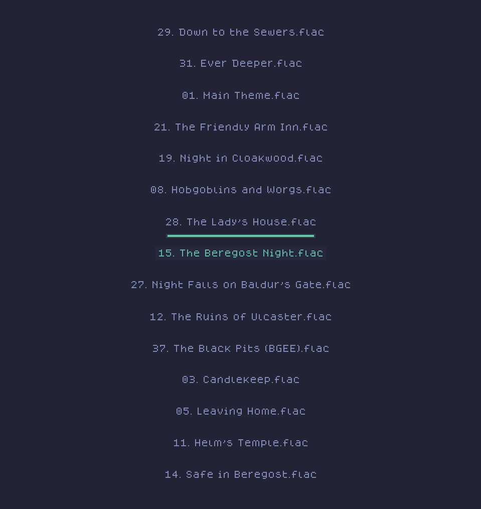

# USAGE RESTRICTIONS
 
**By using this music player, you agree to only use music that you have legally obtained the rights to. This includes, but is not limited to, music that you have purchased, obtained through legitimate streaming services, or that is freely available for use under open licenses. Any unauthorized use of copyrighted music is strictly prohibited and may result in legal action.**

## Music Visualizer
I am making this for myself only, but if you wanna use it, check out the build section. I'm considering making releases at this point. So I might get around to it.
### Gallery
> Side note : these images are out of date, and colours can be determined in your config.lua if you compile with lualib.



### Releases
There are currently no releases. If you want to use this program, you will have to build it. Thankfully it's relatively painless. Build steps are at the end of the readme. Thanks!
 
The program relies on directories located in the **~/Music dir located in the home path**.


### Configuration

- ```MVSource``` which is where your music will be located. **The program expects folders inside this directory**, of which contain the audio files. If you used one of my build scripts, these folders are created automatically for you.

- If you compiled with Lua lib, you can change some settings in the config.lua.

## Controls
**General controls**

- Up : Navigate cursor up through current list.
- Down : Navigate cursor down through current list.
- Shift + Down : View visualization
- Shift + Up : View directory node tree.
- Right : Navigate to the right || select an audio file.
- Left : Navigate left.
- Close : Quit.

## BUILDING
My program depends on these libs:

1. libsndfile
2. SDL2-devel
3. SDL2_ttf-devel

> Optional dependencies:

1. Lua

# OTHER REQUIREMENTS
1. CMake
2. MinGW(For windows)

> For windows the most painless option is to use MSYS2 and install all the related packages from there

Building is relatively painless. Just make sure you have the afforementioned libs installed so that **CMake** can search for them.

## Build steps for linux
- Simply run the ```unix_build.sh``` bash script. It will ask if you wish to link with lua, so you can use the config.lua.
The program will be executable from anywhere and you can launch it using ```Vis```


## Build steps for windows
- Run the ```win64_make.sh``` bash script inside a git bash terminal. 


