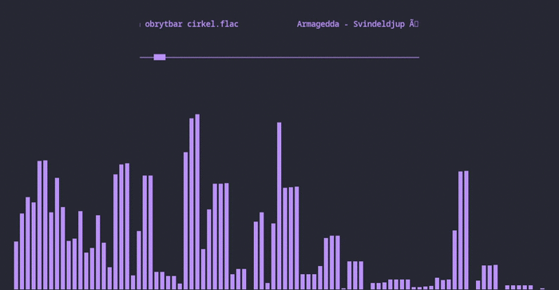

# USAGE RESTRICTIONS
 
**By using this music player, you agree to only use music that you have legally obtained the rights to. This includes, but is not limited to, music that you have purchased, obtained through legitimate streaming services, or that is freely available for use under open licenses. Any unauthorized use of copyrighted music is strictly prohibited and may result in legal action.**

## Music Visualizer


**A music visualizer for Linux systems written in C. This is unfinished software, and the program is mostly written with only my personal use in mind. So please be considerate of this.**

I'm still thinking of a name for this program, haven't really thought of anything yet so I'm just going with Music Visualizer for now. 

## Todo
> - Add multithreading or single threading options for visual audio processing
> - Styling
> - Maybe consider using OpenGL?

## Releases
I am working on creating a release for this program at the moment.

**For more details on how the program works, go below.**

## Usage Manual
**For understanding on how to properly use the program please read the following**.

---
> When the program looks for directories and files, it will replace spaces and comas from folders and files with underscores using rename().
 
The program relies on directories located in the **~/Music dir located in the home path**.

> Foundational directories will be **created on the initial program launch if they do not already exist:**
- ```fftmlogs``` which contains ```errlog.txt``` and ```log.txt```
- ```fftmplayer``` which is where your music will be located. **The program expects folders inside this directory**, of which contain the audio files.
---

**Your music and folders will be listed when there is no music playing ; you can scroll through with the mouse wheel**. 

## Controls
- Space : Play or Stop
- p : Pause or Resume
- Left and right arrow keys : Cycle through songs
- r : random song
- q : Quit

## Build Requirements
* **[A Linux Distribution]**

>  The following are required to build. The packages I am providing here are for Debian repos.

- SDL2 ```sudo apt install libsdl2-dev```
- libsndfile ```sudo apt install libsndfile1``` 
- SDL_ttf ```sudo apt install libsdl2-ttf-dev```                  

## Building
- ```git clone https://github.com/Cameron-Ord/fft_music_visualizer``` 

> MinGW x86_64 is required to build the windows binary

> Clang or GCC is required to build the linux binary

I'm using make for this project. I don't think mingw-make will work out of the box(if you're on windows). Building is as simple as running make linux or make windows. Binarys and their required files will be placed in either LINUX or WINDOWS directories.


